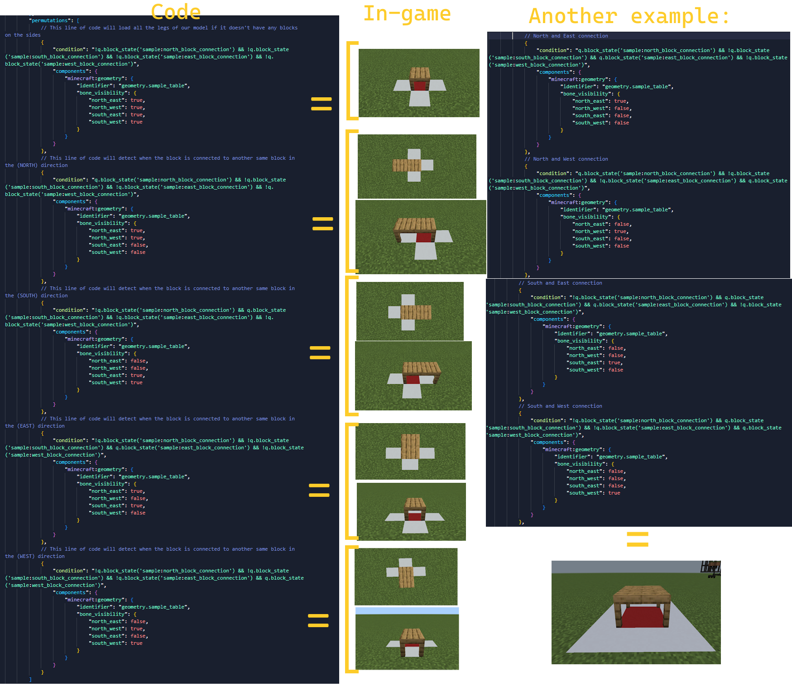

> [!NOTE]
> 🔧 In this tutorial I will teach you how to make a block connect with another nearby block, whether it is a block that is placed in the north position of the block or south etc

# ❓- Connectable blocks (X and Z)
## Requirements:
- It is necessary to create a block as a base, a block without much code, just basic stuff like geometry, texture, collision and more

- Have a base model for the tutorial, for example make a model of a table

- Use a program to edit json files like Visual Studio Code, Bridge, Note pad++,etc...
 - -# (Avoid using mam for this tutorial)

# Here begins the tutorial!
## 1 - Making a basic code
First prepare a basic code for a custom block, something like this:


_____________________________________

## 2 - Adding the "states" section
 Near the `identifier` or `creative_category` section you will move to a new line and write `"states": {}`

-# What is this for? This is intended to add states to your block, either something like variants that can be used in block events and things like that


_____________________________________

## 3 - Adding states to our block
 After doing this, inside that section you will create 4 different states under the name of `"sample:#####_block_connection"` (you can change this name)
-# If you are wondering why I wrote ##### in the block_connection section, it is because here you have to write the type of orientation, whether north, south, west, east

- Here is an example of what you should write:
```
			"states": {
				"sample:north_block_connection": [
					0,
					1
				],
				"sample:south_block_connection": [
					0,
					1
				],
				"sample:east_block_connection": [
					0,
					1
				],
				"sample:west_block_connection": [
					0,
					1
				]
			}
```
- Remember that you can give it a different name as long as you know what you are already doing, in any case this will not affect the tutorial, just always remember to add the block orientation type so you can know what position that state will be used


_____________________________________

## 4 - Set a tick on the block
 After that we will go to the "components" section and write the following:
```
			"minecraft:tick": {
				"interval_range": [
					3,
					3
				]
			}
```

### Fun fact about tick:
 it's used to make an event in our block run at a certain time, for example our block has 3 ticks so it will run an event after 3 ticks, if it's set to 20 ticks it will be one second in real life which is not recommended for a connecting block as the block will look a bit cut off but it will be more optimized, if it's set to 1 tick it's possible that your block will run events faster and you won't notice the difference that the block had already changed its variant although it can make your block slightly slow down the world if several are placed at once


_____________________________________

## 5 - Making a folder for our scripts
After doing that you will need to make a folder in your BP folder called "scripts"


_____________________________________

## 6 - Creating our script and custom component
Now open the "main.js" file and write the following:
`import "./table_connect.js"`

After having written that now open the file `table_connect.js` (or whatever name you have written to this file) and you will start writing something like this
```
import { world } from '@minecraft/server';

world.beforeEvents.worldInitialize.subscribe(eventData => {
  eventData.blockComponentRegistry.registerCustomComponent('sample:table_custom_component', {
	
  });
});
```

You might be wondering what all this is for? Well let me explain

### import { world } from '@minecraft/server';
- Its function is to import the @minecraft/server module into your script, this in order to make it functional in-game, for example when we import something like { world } it is because the code includes events that will be used to detect world events, for example if a player places this block or if he destroys it, or if the player interacts with the block etc

### world.beforeEvents.worldInitialize.subscribe(eventData => {
### });
- This line of code has the function of initializing a subscribe event which will be executed before the player does anything in the world, for example if we write
```
eventData.blockComponentRegistry.registerCustomComponent('sample:table_custom_component', {
});
```
the event will register this event before it happens, in this case it will register the custom component loader event before, so everything we add to this event will be executed before the player places the block with said custom component

## But now the important question is... how do I register a custom component? 
- Well this is simple

Just write something like this:
```
world.beforeEvents.worldInitialize.subscribe(eventData => {
  eventData.blockComponentRegistry.registerCustomComponent('sample:table_custom_component', {
  });
});
```
Remember that this always will be written below `import { world } from '@minecraft/server';`


_____________________________________

## 7 - Adding events to our custom component
Now! Inside this code we will write the following:
```
    onTick(e) {
      const { block } = e;
      const north = block.north();
      const east = block.east();
      const south = block.south();
      const west = block.west();
    }
```

You're probably wondering... what is this for?
Well, let me explain again!

### OnTick
- Its function is to make a block event run at a certain time or ticks, practically this script will use the ticks that we established in our block previously

### Now pay serious attention to this **(is important)**:
- The const event allows our block to execute some type of event in our block in constant with some other line of code, for example
`const north = block.north();`

When we use the word `north` in our code in some block event or some `if` event, what the script will do is load what is next to the event, which is `block.north();`

In practice, we could say that they are important variants that will be used in our block, for example: block.north(); detects that a block is placed on the north side of our block
if in that section something like block.above() is written; now our block will be able to detect that there is a block above our block

### Now following the block.north(); event
 when a block with the same ID, practically the block to which you are adding this custom component, is placed on the north side of the same block, a line of code can be executed which is this
```
      if (north?.typeId === block.typeId) block.setPermutation(block.permutation.withState('sample:north_block_connection', north ? 1 : 0));
      else block.setPermutation(block.permutation.withState('sample:north_block_connection', 0));
```
and what it does is set the value 1 of the state of our block, and thus it can connect with that same block

and it will be the same pattern for all sides (south, east, west)

and DONE!

This would be the code for our block, now copy the name of the custom component, the one marked in purple in the image 
-# (although the name may vary depending on what other name you added)

```
world.beforeEvents.worldInitialize.subscribe(eventData => {
    eventData.blockComponentRegistry.registerCustomComponent('sample:table_custom_component', {
    onTick(e) {
      const { block } = e;
      const north = block.north();
      const east = block.east();
      const south = block.south();
      const west = block.west();
      if (north?.typeId === block.typeId) block.setPermutation(block.permutation.withState('sample:south_block_connection', north ? 1 : 0));
      else block.setPermutation(block.permutation.withState('sample:south_block_connection', 0));

      if (south?.typeId === block.typeId) block.setPermutation(block.permutation.withState('sample:north_block_connection', south ? 1 : 0));
      else block.setPermutation(block.permutation.withState('sample:north_block_connection', 0));

      if (east?.typeId === block.typeId) block.setPermutation(block.permutation.withState('sample:west_block_connection', east ? 1 : 0));
      else block.setPermutation(block.permutation.withState('sample:west_block_connection', 0));

      if (west?.typeId === block.typeId) block.setPermutation(block.permutation.withState('sample:east_block_connection', west ? 1 : 0));
      else block.setPermutation(block.permutation.withState('sample:east_block_connection', 0));
    }
  });
});
```


_____________________________________

## 8 - Adding our custom component
After saving the file in which you wrote the script, go to your block file and write the following in the "components" section
```
			"minecraft:custom_components": [
				"sample:table_custom_component"
			]
```
- Remember that if you changed the name of the custom component you will have to write it here

## 8.5 - Create a template (or use one already made)
Make a model similar to this one (you can edit it later)

and on the legs of our table you will create folders under the name of `north_east`, `north_west`, `south_west` and `south_east`

- Example:


_____________________________________
## 9 -  Adding variants to our block states
Now we are going to make our block states depending on where our block is connected to

### IMPORTANT
The legs of our table will be activated depending on the orientation, for example if there is a block in the north position, only the legs that are in the south position will be activated
- this would be the code for that block state
```
				"components": {
					"minecraft:geometry": {
						"identifier": "geometry.sample_table",
						"bone_visibility": {
							"north_east": false,
							"north_west": false,
							"south_east": true,
							"south_west": true
						}
					}
				}
```
### ALSO
Please note that this tutorial does not add all types of block states, you can add them on your own as this can help you with practice



_____________________________________
## 10 - Adding our script to the BP manifest


## Note:

- I would recommend that you watch the full tutorial to avoid any confusion about what each thing is for

## Full codes:
### Block
```
{
	"format_version": "1.20.80",
	"minecraft:block": {
		"description": {
			"identifier": "test:table",
			"menu_category": {
				"category": "construction"
			},
			"states": {
				"sample:north_block_connection": [
					0,
					1
				],
				"sample:south_block_connection": [
					0,
					1
				],
				"sample:east_block_connection": [
					0,
					1
				],
				"sample:west_block_connection": [
					0,
					1
				]
			}
		},
		"components": {
			"minecraft:geometry": {
				"identifier": "geometry.sample_table",
				"bone_visibility": {
					"north_east": true,
					"north_west": true,
					"south_east": true,
					"south_west": true
				}
			},
			"minecraft:material_instances": {
				"*": {
					"texture": "oak_planks",
					"render_method": "alpha_test"
				}
			},
			"minecraft:collision_box": {
				"origin": [
					-8,
					12,
					-8
				],
				"size": [
					16,
					4,
					16
				]
			},
			"minecraft:selection_box": {
				"origin": [
					-8,
					12,
					-8
				],
				"size": [
					16,
					4,
					16
				]
			},
			"minecraft:tick": {
				"interval_range": [
					3,
					3
				]
			},
			"minecraft:custom_components": [
				"sample:table_custom_component"
			]
		},
		"permutations": [
			// Without connections
			{
				"condition": "!q.block_state('sample:north_block_connection') && !q.block_state('sample:south_block_connection') && !q.block_state('sample:east_block_connection') && !q.block_state('sample:west_block_connection')",
				"components": {
					"minecraft:geometry": {
						"identifier": "geometry.sample_table",
						"bone_visibility": {
							"north_east": true,
							"north_west": true,
							"south_east": true,
							"south_west": true
						}
					}
				}
			},
			// This line of code will detect when the block is connected to another same block in the (NORTH) direction
			{
				"condition": "q.block_state('sample:north_block_connection') && !q.block_state('sample:south_block_connection') && !q.block_state('sample:east_block_connection') && !q.block_state('sample:west_block_connection')",
				"components": {
					"minecraft:geometry": {
						"identifier": "geometry.sample_table",
						"bone_visibility": {
							"north_east": true,
							"north_west": true,
							"south_east": false,
							"south_west": false
						}
					}
				}
			},
			// This line of code will detect when the block is connected to another same block in the (SOUTH) direction
			{
				"condition": "!q.block_state('sample:north_block_connection') && q.block_state('sample:south_block_connection') && !q.block_state('sample:east_block_connection') && !q.block_state('sample:west_block_connection')",
				"components": {
					"minecraft:geometry": {
						"identifier": "geometry.sample_table",
						"bone_visibility": {
							"north_east": false,
							"north_west": false,
							"south_east": true,
							"south_west": true
						}
					}
				}
			},
			// This line of code will detect when the block is connected to another same block in the (EAST) direction
			{
				"condition": "!q.block_state('sample:north_block_connection') && !q.block_state('sample:south_block_connection') && q.block_state('sample:east_block_connection') && !q.block_state('sample:west_block_connection')",
				"components": {
					"minecraft:geometry": {
						"identifier": "geometry.sample_table",
						"bone_visibility": {
							"north_east": true,
							"north_west": false,
							"south_east": true,
							"south_west": false
						}
					}
				}
			},
			// This line of code will detect when the block is connected to another same block in the (WEST) direction
			{
				"condition": "!q.block_state('sample:north_block_connection') && !q.block_state('sample:south_block_connection') && !q.block_state('sample:east_block_connection') && q.block_state('sample:west_block_connection')",
				"components": {
					"minecraft:geometry": {
						"identifier": "geometry.sample_table",
						"bone_visibility": {
							"north_east": false,
							"north_west": false,
							"south_east": false,
							"south_west": false
						}
					}
				}
			},
			// North and East connection
			{
				"condition": "q.block_state('sample:north_block_connection') && !q.block_state('sample:south_block_connection') && q.block_state('sample:east_block_connection') && !q.block_state('sample:west_block_connection')",
				"components": {
					"minecraft:geometry": {
						"identifier": "geometry.sample_table",
						"bone_visibility": {
							"north_east": true,
							"north_west": false,
							"south_east": false,
							"south_west": false
						}
					}
				}
			},
			// North and West connection
			{
				"condition": "q.block_state('sample:north_block_connection') && !q.block_state('sample:south_block_connection') && !q.block_state('sample:east_block_connection') && q.block_state('sample:west_block_connection')",
				"components": {
					"minecraft:geometry": {
						"identifier": "geometry.sample_table",
						"bone_visibility": {
							"north_east": false,
							"north_west": true,
							"south_east": false,
							"south_west": false
						}
					}
				}
			},
			// South and East connection
			{
				"condition": "!q.block_state('sample:north_block_connection') && q.block_state('sample:south_block_connection') && q.block_state('sample:east_block_connection') && !q.block_state('sample:west_block_connection')",
				"components": {
					"minecraft:geometry": {
						"identifier": "geometry.sample_table",
						"bone_visibility": {
							"north_east": false,
							"north_west": false,
							"south_east": true,
							"south_west": false
						}
					}
				}
			},
			// South and West connection 
			{
				"condition": "!q.block_state('sample:north_block_connection') && q.block_state('sample:south_block_connection') && !q.block_state('sample:east_block_connection') && q.block_state('sample:west_block_connection')",
				"components": {
					"minecraft:geometry": {
						"identifier": "geometry.sample_table",
						"bone_visibility": {
							"north_east": false,
							"north_west": false,
							"south_east": false,
							"south_west": true
						}
					}
				}
			},
			// Center connection
			{
				"condition": "q.block_state('sample:north_block_connection') && q.block_state('sample:south_block_connection') && q.block_state('sample:east_block_connection') && q.block_state('sample:west_block_connection')",
				"components": {
					"minecraft:geometry": {
						"identifier": "geometry.sample_table",
						"bone_visibility": {
							"north_east": true,
							"north_west": true,
							"south_east": true,
							"south_west": true
						}
					}
				}
			}
		]
	}
}
```

### Script code
```
import { world } from '@minecraft/server';

world.beforeEvents.worldInitialize.subscribe(eventData => {
  eventData.blockComponentRegistry.registerCustomComponent('sample:table_custom_component', {
    onTick(e) {
      const { block } = e;
      const north = block.north();
      const east = block.east();
      const south = block.south();
      const west = block.west();
      if (north?.typeId === block.typeId) block.setPermutation(block.permutation.withState('sample:south_block_connection', north ? 1 : 0));
      else block.setPermutation(block.permutation.withState('sample:south_block_connection', 0));

      if (south?.typeId === block.typeId) block.setPermutation(block.permutation.withState('sample:north_block_connection', south ? 1 : 0));
      else block.setPermutation(block.permutation.withState('sample:north_block_connection', 0));

      if (east?.typeId === block.typeId) block.setPermutation(block.permutation.withState('sample:west_block_connection', east ? 1 : 0));
      else block.setPermutation(block.permutation.withState('sample:west_block_connection', 0));

      if (west?.typeId === block.typeId) block.setPermutation(block.permutation.withState('sample:east_block_connection', west ? 1 : 0));
      else block.setPermutation(block.permutation.withState('sample:east_block_connection', 0));
    }
  });
});
```
